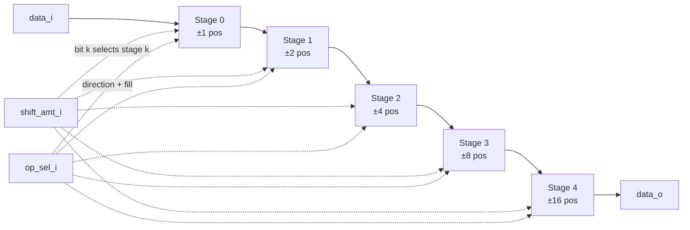

# Exercise #2: Parameterized Barrel Shifter

## 1. Introduction

A barrel shifter is the canonical example of trading hardware breadth for combinational depth: instead of shifting one bit position per clock cycle (as a naive shift register would), it computes an arbitrary shift or rotate in a single combinational pass using $\lceil \log_2 N \rceil$ stages of muxes. It shows up as a sub-block almost everywhere in this curriculum — ALU (#9), CORDIC (#23), floating-point normalization (Track F), and the RV32I pipeline (#47) all need one. Getting a clean, reusable implementation now pays off repeatedly later.

This exercise builds a single shared datapath that supports five operations — logical left/right shift, arithmetic right shift, and rotate left/right — using one log-staged structure rather than five independent shifters.

## 2. Theory & Math

**Naive approach.** A shift-register-based shifter shifts by 1 bit per stage, requiring up to $DATA\_W - 1$ sequential stages (or cycles) to shift by the maximum amount. Combinational depth / latency is $O(DATA\_W)$.

**Log-shifter approach.** Decompose the shift amount into its binary representation:

$$shift\_amt = \sum_{k=0}^{SHAMT\_W-1} b_k \cdot 2^k, \qquad SHAMT\_W = \lceil \log_2 DATA\_W \rceil$$

Build $SHAMT\_W$ stages in series. Stage $k$ conditionally shifts its input by exactly $2^k$ positions, gated by bit $b_k$ of the shift amount:

$$stage_k = \begin{cases} f_k(stage_{k-1}) & \text{if } b_k = 1 \\ stage_{k-1} & \text{if } b_k = 0 \end{cases}, \qquad stage_0 = data\_i,\ \ data\_o = stage_{SHAMT\_W}$$

where $f_k$ shifts/rotates by $2^k$ in the appropriate direction with the appropriate fill value. Combinational depth is now $O(\log_2 DATA\_W)$ — for $DATA\_W = 32$, that's 5 stages instead of up to 31.

This is the same divide-and-conquer principle behind the Kogge-Stone / Brent-Kung prefix structures you'll see when you get to the pipelined CLA adder (#17) — trading a wider structure for shallower depth.

**Rotate as double-width shift.** A useful identity: rotating an $N$-bit word is equivalent to concatenating two copies of the word into a $2N$-bit value, shifting logically, and truncating:

$$ROL(x, s) = \left[ (x \| x) \ll s \right]_{[2N-1:N]}, \qquad ROR(x, s) = \left[ (x \| x) \gg s \right]_{[N-1:0]}$$

This identity is a hint for how to unify the rotate stages with the logical-shift stages — you don't need fundamentally different logic for each.

## 3. Design Specification

### Parameters

| Name | Description | Default |
|---|---|---|
| `DATA_W` | Data width in bits | 32 |
| `STAGES` | Number of log-shift stages, derived as $\lceil \log_2 DATA\_W \rceil$ (localparam, not user-set) | 5 (for `DATA_W=32`) |

### Interface

Purely combinational — no clock or reset required.

| Port | Width | Dir | Description |
|---|---|---|---|
| `data_i` | `DATA_W` | in | Input word |
| `shift_amt_i` | `$clog2(DATA_W)` | in | Shift/rotate amount, range $0 .. DATA\_W-1$ |
| `op_sel_i` | 3 | in | Operation select (encoding below) |
| `data_o` | `DATA_W` | out | Result |

### Operation encoding

| `op_sel_i` | Mnemonic | Behavior |
|---|---|---|
| `3'b000` | SLL | Logical shift left, zero-fill LSBs |
| `3'b001` | SRL | Logical shift right, zero-fill MSBs |
| `3'b010` | SRA | Arithmetic shift right, sign-extend from `data_i[DATA_W-1]` |
| `3'b011` | ROL | Rotate left |
| `3'b100` | ROR | Rotate right |
| others | — | Reserved: `data_o` must drive `'0` (not `'x`) |

### Functional description

$$SLL: data\_o = data\_i \ll shift\_amt\_i \pmod{2^{DATA\_W}}$$
$$SRL: data\_o = data\_i \gg shift\_amt\_i, \text{ zero-filled}$$
$$SRA: data\_o = \left\lfloor \dfrac{\text{signed}(data\_i)}{2^{shift\_amt\_i}} \right\rfloor \text{ (arithmetic, sign-filled)}$$
$$ROL: data\_o = ((data\_i \ll shift\_amt\_i) \mathbin{|} (data\_i \gg (DATA\_W - shift\_amt\_i))) \bmod 2^{DATA\_W}$$
$$ROR: data\_o = ((data\_i \gg shift\_amt\_i) \mathbin{|} (data\_i \ll (DATA\_W - shift\_amt\_i))) \bmod 2^{DATA\_W}$$

**Edge case:** for ROL/ROR when `shift_amt_i == 0`, the naive formula divides by $2^{DATA\_W}$ / shifts by `DATA_W`, which is undefined in a fixed-width shift. Your implementation must special-case `shift_amt_i == 0` to return `data_i` unchanged — this is a common off-by-one bug worth hitting deliberately here.

### Block diagram



### Worked example (`DATA_W = 8`, `data_i = 8'hB2` = `1011_0010`)

| Operation | `shift_amt_i` | Result (bin) | Result (hex) | Note |
|---|---|---|---|---|
| any | 0 | `1011_0010` | `0xB2` | passthrough |
| SLL | 3 | `1001_0000` | `0x90` | zero-fill LSBs |
| SRL | 3 | `0001_0110` | `0x16` | zero-fill MSBs |
| SRA | 3 | `1111_0110` | `0xF6` | sign-fill (MSB was 1) |
| ROL | 3 | `1001_0101` | `0x95` | wrapped bits reappear at LSB |
| ROR | 3 | `0101_0110` | `0x56` | wrapped bits reappear at MSB |

Use this table as a quick sanity check against your own simulation before trusting the full testbench.

## 4. Study Questions

**Conceptual**

1. Why does the log-staged structure guarantee correctness for *every* shift amount from 0 to `DATA_W-1`, given only `STAGES` stages and binary decomposition?
2. Why is `SHAMT_W = $clog2(DATA_W)` sufficient to encode every needed rotate amount, but you still need a special case at `shift_amt_i == 0` for rotates specifically (not for SLL/SRL)?

**Design decisions**

3. You're building one shared datapath for 5 operations rather than 5 separate shifters. What has to be per-stage-configurable (direction, fill value, wrap source) to make that sharing work, and where would you put that muxing — inside each stage, or as a pre/post transform?
4. Consider the double-width concatenation identity in Theory & Math. Could you implement ROL and SRA as special cases of a single generalized "shift a wider intermediate value, then slice" operation? What would that intermediate value need to contain for each of the 5 ops?

**Analysis & estimation**

5. For `DATA_W = 64`, how many stages does the log-shifter need? Estimate mux count per stage and total mux count, and compare against a naive `DATA_W`-deep shift-register approach in both area and worst-case combinational depth.
6. If this block sits directly on a critical path in a later exercise (e.g., feeding the ALU in #47), what's your intuition for how `DATA_W` growth affects $F_{max}$ for the log-shifter vs. the naive shifter?

**Synthesis & implementation**

7. After synthesizing, look at the gate-level netlist for one stage. Did the tool infer a mux tree per your intent, or did it collapse/restructure the stages? What does that tell you about how much the RTL structure actually constrains the synthesized structure vs. just expressing intent?

## 5. Implementation Notes

### Verilog

Use a `generate`/`for` loop to instantiate `STAGES` combinational stages, each producing an intermediate `DATA_W`-bit wire. Prefer `logic` and an unpacked array of wires (`stage[0:STAGES]`) over a single flattened bus — it keeps each stage's intent readable. A `case (op_sel_i)` or `unique case` inside each stage's `always_comb` is a reasonable place to select direction/fill; think carefully about whether that duplicates the case statement 5 times (once per stage) versus resolving mode-dependent behavior once and reusing it.

Skeleton:

```verilog
module barrel_shifter #(
    parameter int DATA_W  = 32,
    parameter int SHIFT_W = $clog2(DATA_W)
) (
    input  logic [DATA_W-1:0]         data_i,
    input  logic [$clog2(DATA_W)-1:0] shift_amt_i,
    input  logic [2:0]                op_sel_i,
    output logic [DATA_W-1:0]         data_o
);

  localparam int STAGES = SHIFT_W;

  logic [DATA_W-1:0] stage [0:STAGES];
  assign stage[0] = data_i;

  genvar k;
  generate
    for (k = 0; k < STAGES; k = k + 1) begin : g_stage
      // TODO: implement stage k
      //   - compute the by-2^k shifted/rotated version of stage[k]
      //     for the currently selected op_sel_i
      //   - mux that against stage[k] unchanged, selected by shift_amt_i[k]
      //   - assign the result to stage[k+1]
      //
      // Hint: the direction (toward MSB vs LSB) and fill value (0, sign,
      // or wrapped bit) both depend on op_sel_i, not on k. Consider whether
      // that logic belongs once per stage or once total.
    end
  endgenerate

  // TODO: handle op_sel_i reserved encodings -> data_o = '0
  assign data_o = stage[STAGES];

endmodule
```

Watch your `$clog2(DATA_W)` usage for non-power-of-2 `DATA_W` — the reg file exercise didn't stress this, but a barrel shifter's bit slicing will misbehave silently if you assume `DATA_W` is always a power of 2.

### Chisel

`Vec` of `UInt` for the per-stage wires maps naturally onto the Verilog structure. Chisel's native `<<` and `>>` operators on `UInt`/`SInt` already do zero-fill and sign-extend respectively — you can lean on those for the per-stage shift-by-$2^k$, rather than hand-building fill logic. `Cat` is your tool for building the rotate wrap. A `switch`/`is` on `io.opSel`, or a small lookup built with `MuxLookup`, are both reasonable for direction/fill selection.

```scala
package common

import chisel3._
import chisel3.util._

class BarrelShifter(dataW: Int = 32) extends Module {
  val stages = log2Ceil(dataW)

  val io = IO(new Bundle {
    val data     = Input(UInt(dataW.W))
    val shiftAmt = Input(UInt(stages.W))
    val opSel    = Input(UInt(3.W))
    val out      = Output(UInt(dataW.W))
  })

  val sll = 0.U(3.W)
  val srl = 1.U(3.W)
  val sra = 2.U(3.W)
  val rol = 3.U(3.W)
  val ror = 4.U(3.W)

  val stageWires = Wire(Vec(stages + 1, UInt(dataW.W)))
  stageWires(0) := io.data

  for (k <- 0 until stages) {
    // TODO: implement stage k
    //   - build the by-2^k shifted/rotated version of stageWires(k)
    //     for io.opSel (consider UInt's built-in << / >>, and
    //     SInt for the arithmetic-shift fill)
    //   - select shifted vs. passthrough using io.shiftAmt(k)
    stageWires(k + 1) := stageWires(k) // placeholder passthrough
  }

  // TODO: reserved opSel encodings -> io.out := 0.U
  io.out := stageWires(stages)
}
```

## 6. Verification Plan

Verify all of the following test cases:

| ID    | Description |
|-------|-------------|
| TC-01 | SLL, `shift_amt_i = 0` — passthrough |
| TC-02 | SLL, `shift_amt_i = DATA_W - 1` — only original LSB survives, at the MSB |
| TC-03 | SRL, `shift_amt_i = DATA_W - 1` — only original MSB survives, at the LSB, zero-filled elsewhere |
| TC-04 | SRA with `data_i[DATA_W-1] = 1` — verify sign fill, not zero fill |
| TC-05 | SRA with `data_i[DATA_W-1] = 0` — verify SRA and SRL agree in this case |
| TC-06 | ROL with `shift_amt_i = 0` — passthrough, confirm the special-case doesn't corrupt output |
| TC-07 | ROL, arbitrary mid-range amount — confirm wrapped bits land correctly (use the worked example table) |
| TC-08 | ROR, arbitrary mid-range amount — same, opposite direction |
| TC-09 | Reserved `op_sel_i` encoding (e.g. `3'b111`) — confirm `data_o == '0`, not `'x` |
| TC-10 | Stress: randomized `data_i`/`shift_amt_i`/`op_sel_i` (valid encodings only) cross-checked against a behavioral reference model built from the five equations in §3 |

Since this block is combinational, there's no reset/timing sequencing to test — the whole testbench can be a loop of `apply-inputs → settle → compare` per case, no clock needed unless you choose to wrap it for the synthesis harness.

## 7. Synthesis & Analysis Targets

Since the design is purely combinational, `report_timing` in DC Shell without a clock will report the longest unconstrained path — this is your effective critical path. Instantiate the module in a wrapper with `set_input_delay`/`set_output_delay` against a synthetic clock (pick something generous, e.g. 5 ns) so the tool has a timing reference to work against.

Targets:
- Report cell area and worst-case arrival time for `DATA_W = 32`.
- Re-synthesize for `DATA_W = 8, 16, 64` and plot delay vs. `DATA_W`. Confirm the trend looks closer to logarithmic than linear.
- Compare the stage count reported in your RTL structure against what the synthesized netlist actually contains — did the tool preserve your stage boundaries, or optimize across them?

## 8. Optional Extensions

- Add a `signed_i` control bit to fold SRL/SRA into a single "right shift" op with a mode bit, freeing up `op_sel_i` encoding space.
- SIMD-style sub-word shifter: parameterize a `SUB_W` such that `data_i` is treated as `DATA_W/SUB_W` independent lanes, each shifted by the same amount within its own lane width (useful groundwork for Track G SIMT work later).
- Registered/pipelined variant: add `clk_i`/`rst_ni` and a parameter for how many stages get a register between them, trading latency for $F_{max}$ — a preview of the pipelining decisions in the CLA adder (#17) and FIR filter (#21).
- Saturating shift amount: clamp `shift_amt_i` values that would be meaningless (not really applicable here since full range is always valid, but worth reasoning about why — contrast with a hypothetical narrower shifter).

## 9. Reflection

*(fill in after completion)*

- Did you end up resolving direction/fill logic once and reusing it across stages, or once per stage? What drove that choice?

<details>
<summary>Answer</summary>

Once per stage, then recursively in a for loop apply the same logic of each subsequent stage.

</details>

- Where did the `shift_amt_i == 0` rotate edge case bite you, if it did?

<details>
<summary>Answer</summary>

This was easily resolved by a simple MUX.

</details>

- How closely did synthesized delay scaling match your log2 prediction across `DATA_W` sweeps?

- What would you do differently if you had known from the start you'd need the SIMD sub-word extension?