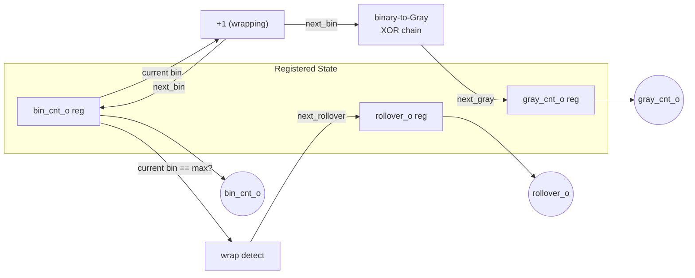

# Exercise #3: Gray/Binary Counter

`exercises/03_gray_binary_counter/SPEC.md`

## 1. Introduction

A Gray/binary counter is a dual-output up-counter that maintains a standard binary count alongside a Gray-coded representation of the same value, updated in lockstep. Its defining property — that consecutive Gray code values differ in exactly one bit position — makes it the standard building block for pointers that must cross clock domains, most notably the read/write pointers in an asynchronous FIFO (#10). A plain binary counter crossing a clock boundary can have multiple bits changing simultaneously; a synchronizing flop sampling mid-transition can catch an arbitrary mix of old and new bits, producing a wildly incorrect value. Gray code eliminates that failure mode by construction.

This exercise is deliberately compact (L1 scope), but the conversion logic you write here — and the registered-output design decision you'll justify — gets reused directly when you build the async FIFO pointer logic later in the curriculum.

## 2. Theory & Math

**Binary-to-Gray conversion.** Given an $n$-bit binary value $B = b_{n-1} \ldots b_1 b_0$, the corresponding Gray code $G = g_{n-1} \ldots g_1 g_0$ is:

$$G = B \oplus (B \gg 1)$$

Per-bit, this expands to:

$$g_{n-1} = b_{n-1}, \qquad g_i = b_i \oplus b_{i+1} \quad \text{for } i = 0, \ldots, n-2$$

Note that every $g_i$ depends only on two adjacent bits of $B$ — there is no bit-to-bit dependency chain. Encoding is $O(1)$ deep, fully parallel.

**Gray-to-binary conversion (inverse).** Reconstructing $B$ from $G$ requires a prefix-XOR:

$$b_{n-1} = g_{n-1}, \qquad b_i = b_{i+1} \oplus g_i \quad \text{for } i = n-2, \ldots, 0$$

Unlike encoding, each $b_i$ depends on $b_{i+1}$, which depends on $b_{i+2}$, and so on — this is an $O(n)$-deep ripple chain. Encode and decode are not symmetric in cost, which matters once you get to the estimation questions below.

**Cyclic single-bit-transition property.** The standard reflected binary Gray code sequence of length $2^n$ forms a Hamiltonian cycle on the $n$-dimensional hypercube: consecutive codewords differ by exactly one bit, *and* this holds across the wraparound (codeword $2^n - 1$ back to codeword $0$) as well as between interior values. This is why a Gray counter's rollover is just as CDC-safe as any other transition — no special-casing needed at the boundary.

**Why this matters for CDC.** When a counter value is sampled by a synchronizer in another clock domain, only Gray-coded values guarantee that the synchronizer reads either the old value or the new value — never a spurious intermediate one — because at most one bit is in flight at any sampling instant. This technique, and the registered-conversion architecture used below, follows the widely-used approach popularized in Clifford Cummings' asynchronous FIFO design papers.

## 3. Design Specification

### Parameters

| Name | Description | Default |
|---|---|---|
| `CNT_W` | Counter width in bits | 4 |

### Interface

| Signal | Direction | Width | Description |
|---|---|---|---|
| `clk_i` | Input | 1 | System clock |
| `rst_ni` | Input | 1 | Active-low synchronous reset |
| `en_i` | Input | 1 | Count enable; when high, counter advances on the next rising edge |
| `bin_cnt_o` | Output | `CNT_W` | Current count, standard binary |
| `gray_cnt_o` | Output | `CNT_W` | Current count, Gray code |
| `rollover_o` | Output | 1 | Pulses high for exactly one cycle when the count wraps from $2^{CNT\_W}-1$ back to 0 |

### Functional Description

- On `rst_ni` low, `bin_cnt_o`, `gray_cnt_o`, and `rollover_o` synchronously reset to 0.
- When `en_i` is high, `bin_cnt_o` increments by 1 on the next rising edge of `clk_i`, wrapping from $2^{CNT\_W}-1$ to 0.
- **`gray_cnt_o` is its own register**, not a combinational function of `bin_cnt_o` routed through conversion logic. Both `next_bin` and `next_gray` are computed combinationally from the *current* state each cycle, and both registers update together. This avoids exposing any combinational glitch on the conversion path to whatever downstream logic (e.g., a CDC synchronizer) consumes `gray_cnt_o` — see Design Decisions below for why this matters.
- `rollover_o` is also registered, and updates every cycle regardless of `en_i` — it reflects whether a wrap occurred on the *previous* enabled edge, and self-clears the cycle after.

### Timing Diagram

Shown with `CNT_W=2` for compactness (values wrap at 3→0).

```json
{
  "signal": [
    { "name": "clk_i",      "wave": "ppppppppp" },
    { "name": "rst_ni",     "wave": "01......." },
    { "name": "en_i",       "wave": "0.1......" },
    { "name": "bin_cnt_o",  "wave": "x2.222222", "data": ["0","1","2","3","0","1","2"] },
    { "name": "gray_cnt_o", "wave": "x2.222222", "data": ["0","1","3","2","0","1","3"] },
    { "name": "rollover_o", "wave": "0.....10." }
  ],
  "head": { "text": "Gray/Binary Counter — CNT_W=2 (illustrative)" }
}
```

Note `bin_cnt_o` and `gray_cnt_o` change on the same edges (they're registered in lockstep), and `rollover_o` pulses exactly one cycle after `bin_cnt_o` wraps from `3` to `0`.

### Block Diagram



## 4. Study Questions

### Conceptual
1. Prove that $G = B \oplus (B \gg 1)$ guarantees exactly one bit changes between $G(B)$ and $G(B+1)$ for any $B$ in $[0, 2^n-2]$.

<details>
<summary>Answer</summary>

You can verify a side-by-side scenario for this:

| Binary  |  Grey   |
| ------- | ------- |
| 0000    | 0000    |
| 0001    | 0001    |
| 0010    | 0011    |
| 0011    | 0010    |
| 0100    | 0110    |
| 0101    | 0111    |
| 0110    | 0101    |
| 0111    | 0100    |
| 1000    | 1100    |
| 1001    | 1101    |
| 1010    | 1111    |
| 1011    | 1110    |
| 1100    | 1010    |
| 1101    | 1011    |
| 1110    | 1001    |
| 1111    | 1000    |

If you take the binary and follow the working equation, you can easily prove the grey code is correct regardless of binary length.

</details>


2. Extend your proof to the wraparound case: show that $G(2^n-1)$ and $G(0)$ also differ by exactly one bit.

<details>
<summary>Answer</summary>

For $n=4$, the last grey code is 1000 and it wraps around correctly to 0000 which is exactly 1-bit change only.

</details>

3. Why does a plain binary counter crossing a clock domain via a 2-flop synchronizer risk sampling a value that was never actually counted? Give a concrete example for `CNT_W=4` (e.g. a transition where several bits change at once).

<details>
<summary>Answer</summary>

For $n=4$, suppose we get the binary values 0001 and shifts to 0010 which is numerically in order. The problem is that the 2nd bit switches to 1 and the 1st bit switches to 0 at the same time. This change can risk a change for CDC crossings. The worst-case happens when all are 1111 and wraps around back to 0 which changes all 4 bits at once.

</details>

4. Derive the Gray-to-binary formula from the definition of $G$ — show your work, don't just state the known identity.

<details>
<summary>Answer</summary>

Derivation is simple, first let's analyze by expanding the binary to grey:

$$ G = B \oplus (B \gg 1)$$

This expands to on a per-element basis as:

$$ g_{n-1} = b_{n-1} \oplus 0 = g_{n-1} = b_{n-1} $$

The above is for the MSB. The $0$ was due to the right-shift. This is exactly the prefix earlier: $b_{n-1} = g_{n-1}$. 


For anything after the MSB we have:

$$ g_{i} = b_{i} \oplus b_{i-1} $$

We can-rearrange by first applying a shift index in the notation and technically it gives the equivalent:

$$ g_{i+1} = b_{i+1} \oplus b_{i} $$

Then we use the property of XOR such that $A \oplus A = 1$, and we since $b_{n-1} = g_{n-1}$ we know that $b_{n-1}$ is the MSB so we can re-use that by:

$$ b_{i+1} \oplus g_{i+1} = b_{i+1} \oplus b_{i+1} \oplus b_{i} $$

Re-arrangeing and applying the property results in the target binary value:

$$b_i = b_{i+1} \oplus g_{i+1} $$

This shows the proof.
</details>

### Design Decisions
1. This spec registers `gray_cnt_o` independently rather than deriving it combinationally from `bin_cnt_o` through conversion logic every cycle. What could go wrong with the combinational approach if `gray_cnt_o` fed a downstream CDC synchronizer directly? What would go wrong if it *didn't* feed a CDC synchronizer — is the registered approach still worth the extra flops?

<details>
<summary>Answer</summary>

They key for CDC is to avoit glitches that can potentially corrupt glitches for receiving end registers. So registering the output is a necessary step because ideally CDC should be a register-to-register transfer without any logic in between.

</details>


2. `rollover_o` is registered and updates unconditionally (not gated by `en_i`) each cycle. What would break if you instead gated its update by `en_i` like the counters?

<details>
<summary>Answer</summary>

They key for CDC is to avoit glitches that can potentially corrupt glitches for receiving end registers. So registering the output is a necessary step because ideally CDC should be a register-to-register transfer without any logic in between.

</details>

3. Why `CNT_W` rather than `DEPTH` as the parameter name here? Where would `DEPTH` be the more appropriate name instead — think ahead to the FIFO exercise (#10).

### Analysis & Estimation
1. For `CNT_W=8`, enumerate the 256-entry counting sequence and confirm the Hamming distance between every pair of temporally-adjacent Gray values (including the wraparound pair) is exactly 1.
2. Binary-to-Gray encoding is $O(1)$ deep (parallel XORs); Gray-to-binary decoding is $O(n)$ deep (ripple XOR chain). This module only needs to encode. Where in this curriculum would you actually need the decode direction, and what would its critical path look like at large width?

### Synthesis & Implementation
1. At your target clock (see Section 7), compare the critical path of the registered `gray_cnt_o` design against a hypothetical combinational-conversion variant (conversion logic between `bin_cnt_o`'s register and a downstream flop, rather than its own register). Which has the shorter register-to-register path, and why?
2. Does the XOR chain in the encoder become a fanout concern for `bin_cnt_o` bit 0 at large `CNT_W`? Check the synthesis report's fanout for that net.

## 5. Implementation Notes

### Verilog (SystemVerilog)

```systemverilog
module gray_counter #(
    parameter int CNT_W = 4
) (
    input  logic             clk_i,
    input  logic             rst_ni,
    input  logic             en_i,
    output logic [CNT_W-1:0] bin_cnt_o,
    output logic [CNT_W-1:0] gray_cnt_o,
    output logic             rollover_o
);

  logic [CNT_W-1:0] next_bin;
  logic [CNT_W-1:0] next_gray;
  logic             next_rollover;

  assign next_bin = bin_cnt_o + 1'b1;

  // TODO: Compute next_gray from next_bin using the binary-to-Gray
  // conversion identity derived in Theory & Math (Section 2).
  // assign next_gray = ...;

  assign next_rollover = en_i && (bin_cnt_o == {CNT_W{1'b1}});

  always_ff @(posedge clk_i) begin
    if (!rst_ni) begin
      bin_cnt_o  <= '0;
      gray_cnt_o <= '0;
      rollover_o <= 1'b0;
    end else begin
      rollover_o <= next_rollover;
      if (en_i) begin
        bin_cnt_o  <= next_bin;
        gray_cnt_o <= next_gray;
      end
    end
  end

endmodule
```

The `next_gray` assignment is left for you to fill in — this is the core learning objective of the exercise. Work it out from the per-bit identity in Section 2, applied to `next_bin` rather than `bin_cnt_o` (since both registers must update to values that are consistent with each other, not with the *current* binary value).

### Chisel

```scala
package common

import chisel3._
import chisel3.util._

class GrayCounter(cntW: Int) extends Module {
  val io = IO(new Bundle {
    val en       = Input(Bool())
    val binCnt   = Output(UInt(cntW.W))
    val grayCnt  = Output(UInt(cntW.W))
    val rollover = Output(Bool())
  })

  val binReg  = RegInit(0.U(cntW.W))
  val grayReg = RegInit(0.U(cntW.W))
  val rollReg = RegInit(false.B)

  val nextBin = binReg + 1.U

  // TODO: Compute nextGray from nextBin using the binary-to-Gray
  // conversion identity derived in Theory & Math (Section 2).
  val nextGray = 0.U(cntW.W) // placeholder — replace with the real conversion

  val nextRollover = io.en && (binReg === ((1.U << cntW.U) - 1.U))

  rollReg := nextRollover
  when(io.en) {
    binReg  := nextBin
    grayReg := nextGray
  }

  io.binCnt   := binReg
  io.grayCnt  := grayReg
  io.rollover := rollReg
}
```

Same convention as before: implicit clock/reset, no `_i`/`_o` suffixes on Bundle fields (direction is already carried by `Input()`/`Output()`). `RegInit` gives you the synchronous reset-to-0 behavior for free.

## 6. Verification Plan

| ID | Description |
|---|---|
| TC-01 | Reset behavior — assert `rst_ni` low for one cycle; verify `bin_cnt_o`, `gray_cnt_o`, and `rollover_o` all read 0 on the following edge. |
| TC-02 | Enable gating — hold `en_i` low for several cycles; verify both counters remain constant and do not advance. |
| TC-03 | Basic increment sequence — enable counting through a full cycle of all $2^{CNT\_W}$ values; verify `bin_cnt_o` increments by exactly 1 each enabled edge and `gray_cnt_o` matches the expected binary-to-Gray conversion at every step. |
| TC-04 | Single-bit Gray transition property — across the full counting sequence (including the wraparound), verify `gray_cnt_o` changes in exactly one bit position between any two consecutive enabled edges. |
| TC-05 | Rollover pulse — verify `rollover_o` pulses high for exactly one cycle when `bin_cnt_o` transitions from $2^{CNT\_W}-1$ to 0, and stays low at all other times, including cycles where `en_i` is low. |
| TC-06 | Irregular enable toggling — toggle `en_i` on and off in a non-uniform pattern; verify the counter only advances on edges where `en_i` was high on the preceding cycle. |
| TC-07 | Reset during active counting — assert `rst_ni` mid-sequence while `en_i` is high; verify both outputs return to 0 immediately and normal counting resumes correctly afterward. |
| TC-08 | Gray-to-binary round trip (self-check) — in the golden reference model, independently reconstruct binary from `gray_cnt_o` using the reverse XOR-chain formula and confirm it matches `bin_cnt_o` on every sampled cycle. |
| TC-09 | Width parameter sweep — instantiate with at least two different `CNT_W` values (e.g., 3 and 8) and re-run TC-03/TC-04/TC-05 for each, confirming behavior holds at both boundary and non-trivial widths. |

## 7. Synthesis & Analysis Targets

- Target clock: 500 MHz (this datapath is tiny — a good exercise in confirming your constraints file and timing report methodology rather than fighting for closure).
- Report: total cell area, register count, and the register-to-register critical path (should run through the Gray encoder's XOR chain).
- Sweep `CNT_W` across {4, 8, 16, 32} and record how $f_{max}$ and area scale. Since the encoder is $O(1)$-deep regardless of width, $f_{max}$ should stay roughly flat — confirm this holds in your actual synthesis report, not just in theory.

## 8. Optional Extensions

1. **Direct Gray-code increment.** Implement a variant that maintains *only* a Gray-code register — no binary counter at all — using a parity-based next-state rule (research the "Gray code counter" direct-increment algorithm; it hinges on the overall parity of the current codeword and the position of its lowest set bit). Compare its critical path and area against the convert-from-binary approach in this spec.
2. **Up/down Gray counter.** Add a `dir_i` input and support decrementing. Note that the direct-increment algorithm from extension 1 does *not* trivially reverse — think about why before you start.
3. **Synchronous clear.** Add a `clear_i` input distinct from `rst_ni`, and write a test case establishing priority between simultaneous `rst_ni` and `clear_i` assertion.
4. **Full CDC demo.** Wrap this module with a 2-flop synchronizer on `gray_cnt_o` crossing into a second clock domain, and build a testbench with two clocks to observe the synchronizer never latching an intermediate value — this is a direct preview of what you'll need for the async FIFO (#10).

## 9. Reflection

*(To be completed after implementation.)*

- What surprised you about the binary-to-Gray conversion once you implemented it in hardware vs. reasoning about it on paper?
- Where did your first-pass RTL diverge from the timing diagram, if anywhere?
- Did the registered-vs-combinational `gray_cnt_o` decision change your synthesis results the way you predicted?