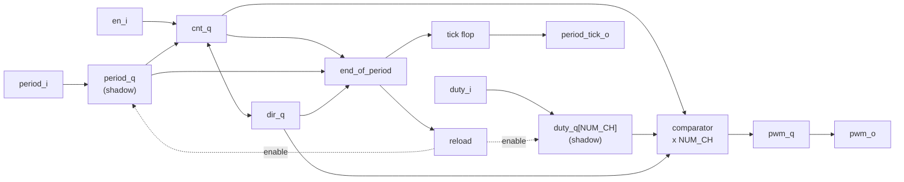

# Exercise #4 — Parameterized PWM Generator

**Level:** L1 (RTL Foundations) · **Phase:** Ph1 · **Languages:** SystemVerilog + Chisel · **Synthesis:** DC Shell

---

## 1. What You Are Building

A PWM (Pulse Width Modulator) makes a square wave where you control what fraction of each period the output is high. That fraction is called the **duty cycle**.

If you feed a PWM output into an LED, 25% duty makes it look dim and 75% makes it look bright. If you feed it into a motor driver, the duty sets the speed. If you feed it into a resistor and capacitor, the average voltage comes out as an analog value — a cheap DAC.

The hardware is two pieces:

1. A **counter** that counts up and wraps around. One trip around the counter is one PWM period.
2. A **comparator** that says "output high while the count is below some threshold." That threshold is the duty value.

That is the whole idea. The rest of this exercise is about the three things that make a real PWM harder than that sentence suggests:

- **Changing the duty safely.** If you change the threshold in the middle of a period, you can get a broken pulse. The fix is a **shadow register**, and it is the main new concept here.
- **Getting exactly 0% and exactly 100%.** These are easy to get wrong by one cycle, and "the LED never fully turns off" is a real bug people ship.
- **Center-aligned mode.** A second counting style where the counter goes up and then back down. It costs more logic but keeps multiple channels lined up nicely.

You already built a counter in Exercise #3. This exercise wraps rules around one.

---

## 2. How Edge-Aligned PWM Works

Edge-aligned is the simple mode. The counter only counts up.

### 2.1 The counter

Let $P$ be the **period value** (often called TOP). The counter goes:

$$0,\ 1,\ 2,\ \dots,\ P,\ 0,\ 1,\ 2,\ \dots$$

**Step 1 — how long is one period?**

The counter visits $P+1$ different values before repeating (don't forget zero). So:

$$T_{\text{edge}} = P + 1 \ \text{clock cycles}$$

**Step 2 — what frequency is that?**

$$f_{\text{pwm}} = \frac{f_{\text{clk}}}{P + 1}$$

Example: at 100 MHz with $P = 99$, the period is 100 cycles and the PWM runs at 1 MHz.

### 2.2 The comparator

Let $D$ be the **duty value**. The rule is:

$$\text{pwm} = 1 \quad \text{when} \quad \text{cnt} < D$$

**Step 3 — count the high cycles.**

The counter values that satisfy $\text{cnt} < D$ are $0, 1, \dots, D-1$. That is $D$ values. But the counter only ever reaches $P$, so if $D$ is bigger than $P+1$ we just get every cycle:

$$H = \min(D,\ P+1)$$

**Step 4 — turn that into a duty ratio.**

$$\delta = \frac{H}{T} = \frac{\min(D,\ P+1)}{P+1}$$

### 2.3 Worked example

$P = 7$, so $T = 8$ cycles. Here is every counter value in one period and what the comparator says for three different duty values:

| cnt | 0 | 1 | 2 | 3 | 4 | 5 | 6 | 7 | high cycles | duty |
|---|---|---|---|---|---|---|---|---|---|---|
| $D = 0$ | 0 | 0 | 0 | 0 | 0 | 0 | 0 | 0 | 0 | 0% |
| $D = 3$ | 1 | 1 | 1 | 0 | 0 | 0 | 0 | 0 | 3 | 37.5% |
| $D = 8$ | 1 | 1 | 1 | 1 | 1 | 1 | 1 | 1 | 8 | 100% |

### 2.4 Why the comparator uses `<` and not `<=`

This is the "exact endpoints" problem, and it is worth walking through both options.

**Option A: `cnt < D`**

- $D = 0$: nothing is less than 0, so the output is always low. **True 0%.** ✓
- $D = P+1$: everything from 0 to $P$ is less than $P+1$, so the output is always high. **True 100%.** ✓

**Option B: `cnt <= D`**

- $D = 0$: $\text{cnt} = 0$ satisfies $0 \le 0$, so you get one high cycle. **You cannot turn the output off.** ✗
- $D = P$: everything satisfies it, so 100% works. ✓

So Option A gives you both endpoints and Option B loses zero. Use `<`.

The reason you can't have it easier: with an $N$-bit counter there are $P+1$ possible high-cycle counts you want to express ($0$ through $P+1$ inclusive is $P+2$ values), which is one more than the counter has states. Option A solves it by letting any $D \ge P+1$ mean "always on", so the extra value comes from the duty input being allowed to exceed the period.

### 2.5 Resolution versus frequency

Effective resolution in bits is:

$$N_{\text{eff}} = \log_2(P+1)$$

Substituting into the frequency formula:

$$f_{\text{pwm}} = \frac{f_{\text{clk}}}{2^{N_{\text{eff}}}}$$

More resolution means a slower PWM, and there is no way around it with this architecture. At 100 MHz, 12 bits of resolution gives about 24.4 kHz. Fine for a motor. Too slow for audio. This is why high-resolution PWM DACs use dithering or sigma-delta instead.

### 2.6 Using it as a DAC (background, not required)

Put the output through an RC filter with time constant $\tau = RC$. The leftover ripple is roughly:

$$V_{\text{ripple}} \approx V_{\text{DD}} \cdot \frac{T_{\text{pwm}}}{\tau} \cdot \delta(1 - \delta)$$

It is worst at 50% duty. Making $\tau$ much larger than the PWM period reduces ripple but makes the output slower to settle.

---

## 3. How Center-Aligned PWM Works

Center-aligned (also called phase-correct) counts up, then back down, then repeats.

### 3.1 The counter

$$0,\ 1,\ \dots,\ P-1,\ \underbrace{P,\ P-1,\ \dots,\ 1}_{\text{coming back down}},\ 0,\ 1,\ \dots$$

We split this into two halves and say the counter has a **direction** bit:

- **Up half:** counter shows $0, 1, \dots, P-1$. That is $P$ cycles.
- **Down half:** counter shows $P, P-1, \dots, 1$. That is also $P$ cycles.

Note that the cycle where the counter shows $P$ belongs to the down half. That is just a convention, but be consistent with it or your cycle counts will drift.

**Step 1 — period length.**

$$T_{\text{center}} = P + P = 2P \ \text{cycles}$$

$$f_{\text{pwm}} = \frac{f_{\text{clk}}}{2P}$$

### 3.2 The comparator is asymmetric

Here is the rule, and then the reason:

$$\text{pwm} = \begin{cases} 1 & \text{cnt} < D \quad \text{(while counting up)} \\ 1 & \text{cnt} \le D \quad \text{(while counting down)} \\ 0 & \text{otherwise} \end{cases}$$

**Step 2 — count the high cycles on the up half.**

Up-half values are $0 \dots P-1$. Those satisfying $\text{cnt} < D$ are $0 \dots D-1$, which is $D$ cycles (assuming $D \le P$).

**Step 3 — count the high cycles on the down half.**

Down-half values are $P \dots 1$. Those satisfying $\text{cnt} \le D$ are $D, D-1, \dots, 1$, which is also $D$ cycles.

**Step 4 — total and ratio.**

$$H = D + D = 2D \qquad\qquad \delta = \frac{2D}{2P} = \frac{D}{P}$$

Clean and linear. Check the endpoints: $D = 0$ gives 0 high cycles (0%), and $D = P$ gives $2P$ (100%). Both work.

### 3.3 Why not just use `<` in both directions?

Try it. Up half still gives $D$ cycles. Down half: values $P \dots 1$ satisfying $\text{cnt} < D$ are $D-1 \dots 1$, which is $D-1$ cycles. Total:

$$H_{\text{naive}} = 2D - 1$$

Two problems:

1. Every duty setting is a half-step low. The step from $D$ to $D+1$ is still 2 cycles, but the whole curve is shifted.
2. At $D = P$ you get $2P - 1$ cycles, so **you can never reach 100%**.

The asymmetric version costs nothing extra in hardware — it is the same comparator with the direction bit selecting `<` or `<=`.

### 3.4 Where the pulse sits, and why "center-aligned"

Worked example: $P = 4$ (so $T = 8$), $D = 2$.

| cycle | 0 | 1 | 2 | 3 | 4 | 5 | 6 | 7 |
|---|---|---|---|---|---|---|---|---|
| cnt | 0 | 1 | 2 | 3 | 4 | 3 | 2 | 1 |
| direction | up | up | up | up | down | down | down | down |
| rule applied | `<2` | `<2` | `<2` | `<2` | `≤2` | `≤2` | `≤2` | `≤2` |
| pwm | 1 | 1 | 0 | 0 | 0 | 0 | 1 | 1 |

Four high cycles out of eight, which is $2D / 2P = 50\%$. ✓

Now look at *where* they are: cycles 6, 7, then wrapping into 0, 1 of the next period. They form one continuous pulse straddling the point where the counter is at 0. Change $D$ and the pulse grows or shrinks around that same center point.

That is the useful property. In edge-aligned mode every channel's pulse starts at the same instant, so all channels switch on at once and you get a current spike. In center-aligned mode the pulses share a center instead of a start, so the switching edges spread out. Three-phase motor drives care about this a lot.

### 3.5 Degenerate periods

- $P = 1$: up half is just cnt=0, down half is just cnt=1. Counter alternates 0,1,0,1. Period is 2 cycles. This works with the normal rules.
- $P = 0$: there is no sensible up/down ramp. **Define it explicitly:** hold the counter at 0, hold direction at up, and treat every cycle as an end-of-period. The output is then 0% when $D = 0$ and 100% otherwise, which matches what edge-aligned mode does at $P = 0$. Without this rule the design can lock up, because the "end of period" condition (counting down and cnt = 1) never becomes true.

---

## 4. Shadow Registers (the main new concept)

### 4.1 The problem

Suppose the comparator reads the duty value straight off the input pin, and software changes that input in the middle of a period.

**Scenario A — a pulse of the wrong width.** $P = 7$, current duty is 6. Software drops the duty to 1, and the write lands as the counter reaches 3.

| cnt | 0 | 1 | 2 | 3 | 4 | 5 | 6 | 7 |
|---|---|---|---|---|---|---|---|---|
| duty on the pin | 6 | 6 | 6 | 1 | 1 | 1 | 1 | 1 |
| `cnt < duty` | 1 | 1 | 1 | 0 | 0 | 0 | 0 | 0 |

You got 3 high cycles. Not the old 6, not the new 1. A width nobody asked for, decided by nothing but the timing of the write.

**Scenario B — a notch, or double pulse.** Same setup, but the duty goes from 1 up to 6 and the write lands at cnt = 2:

| cnt | 0 | 1 | 2 | 3 | 4 | 5 | 6 | 7 |
|---|---|---|---|---|---|---|---|---|
| duty on the pin | 1 | 1 | 6 | 6 | 6 | 6 | 6 | 6 |
| `cnt < duty` | 1 | 0 | 1 | 1 | 1 | 1 | 0 | 0 |

The output went high, low, then high again inside one period. This one is worse than Scenario A. A gate driver that was told to stay on sees a spurious turn-off in the middle of the period, and in a half-bridge that can open a shoot-through path.

Note what is *not* on this list: a pulse longer than both the old and new duty values. In edge-aligned mode the high run always begins at cnt = 0, so its length can never exceed $\max(D_{\text{old}}, D_{\text{new}})$. The two failure modes above are the whole set.

### 4.2 The fix

Keep a second copy of every value that the comparator uses. Call the input `period_i` and the copy `period_q` (same for duty). The comparator only ever reads the copy. The copy only updates at the moment the counter wraps.

The result: every period is generated from one consistent snapshot. Software can write whenever it likes; the change simply takes effect at the next period boundary. No runts, no stretched pulses.

This is called a **shadow register**, or double buffering. You will see the same pattern again in Exercise #24 (APB3), #25 (AXI4-Lite), and #36 (scatter-gather DMA descriptors). It is the standard answer whenever a multi-value update has to look atomic to the hardware consuming it.

### 4.3 One extra rule for the disabled case

While the block is disabled there is no period boundary, so the shadow would never load and the very first period after enabling would use whatever stale values were in there — probably zeros from reset.

So we add: **while disabled, the shadow copies follow the inputs continuously.** Now the first period after enabling uses whatever is on the pins at that moment, which is what a user expects.

---

## 5. Design Specification

### 5.1 Parameters

| Parameter | Type | Default | Description |
|---|---|---|---|
| `CNT_W` | `int unsigned` | `8` | Width in bits of the counter, period, and duty values |
| `NUM_CH` | `int unsigned` | `1` | Number of PWM channels sharing one counter |
| `PHASE_CORRECT` | `bit` | `1'b0` | `0` = edge-aligned, `1` = center-aligned |

Required: `CNT_W >= 1` and `NUM_CH >= 1`. Enforce these with an assertion or `require`.

### 5.2 Ports — SystemVerilog

Inputs end in `_i`, outputs end in `_o`, and active-low signals get an `n` before the direction letter.

| Signal | Dir | Width | Description |
|---|---|---|---|
| `clk_i` | in | 1 | Clock |
| `rst_ni` | in | 1 | Synchronous reset, active low |
| `en_i` | in | 1 | Enable. When low, the counter holds at 0 and the outputs go low |
| `period_i` | in | `CNT_W` | Period value $P$ |
| `duty_i` | in | `NUM_CH` × `CNT_W` (packed 2D) | Duty value $D$ for each channel |
| `pwm_o` | out | `NUM_CH` | The PWM outputs |
| `period_tick_o` | out | 1 | Single-cycle pulse marking the end of a period |

### 5.3 Ports — Chisel

Chisel field names do **not** get `_i` / `_o` suffixes, because `Input()` and `Output()` already say the direction. Clock and reset are implicit.

| Field | Dir | Type |
|---|---|---|
| `en` | in | `Bool` |
| `period` | in | `UInt(cntW.W)` |
| `duty` | in | `Vec(numCh, UInt(cntW.W))` |
| `pwm` | out | `Vec(numCh, Bool())` |
| `periodTick` | out | `Bool` |

### 5.4 Internal signals

Naming convention: `_q` for a register's current value, `_d` for the value it will take next cycle.

| Signal | Width | Meaning |
|---|---|---|
| `cnt_q` / `cnt_d` | `CNT_W` | The counter |
| `dir_q` / `dir_d` | 1 | Count direction. 0 = up, 1 = down. Only used when `PHASE_CORRECT = 1` |
| `period_q` | `CNT_W` | Shadow copy of `period_i` |
| `duty_q` | `NUM_CH` × `CNT_W` | Shadow copies of `duty_i` |
| `pwm_q` | `NUM_CH` | Registered output |
| `end_of_period` | 1 | Combinational. High on the last cycle of a period |
| `reload` | 1 | Combinational. High when the shadows should load |

### 5.5 Requirements

Each requirement is stated, then explained.

---

**R1 — Reset.**
On `rst_ni` low, at the clock edge: `cnt_q ← 0`, `dir_q ← up`, `period_q ← 0`, `duty_q ← 0`, `pwm_q ← 0`, `period_tick_o ← 0`.

*Why:* everything is a synchronous, active-low reset per your house convention. Zeros everywhere gives a defined, quiet starting state.

---

**R2 — Enable.**
While `en_i` is low: hold `cnt_q` at 0, hold `dir_q` at up, drive all `pwm_o` low, drive `period_tick_o` low, and let the shadow registers follow the inputs continuously.

*Why:* the shadow transparency is the rule from §4.3. Note that because `pwm_o` is a registered output (R7), it takes one clock to respond to `en_i` changing. That is expected and you should test for it, not fight it.

---

**R3 — Counting, edge-aligned mode.**
While enabled, `cnt_q` increments each cycle. When `cnt_q >= period_q`, the next value is 0 instead.

*Why `>=` and not `==`:* if the counter were ever somehow above the period value, `==` would never fire and the counter would run all the way around the full $2^{\textrm{CNT-W}}$ range before recovering. `>=` costs the same comparator and cannot get stuck. In this design the shadow only loads at a wrap, so the situation shouldn't arise — but the safe version is free, so take it.

---

**R4 — Counting, center-aligned mode.**
While enabled:

1. If direction is up: increment. If `cnt_q` has reached `period_q`, flip direction to down.
2. If direction is down: decrement. If `cnt_q` is 1, the next value is 0 and direction flips to up.
3. If `period_q` is 0: hold `cnt_q` at 0 and direction at up (see §3.5).

---

**R5 — End of period and `period_tick_o`.**
`end_of_period` is high for exactly one cycle per period, on the last cycle before the counter returns to 0:

- Edge-aligned: `cnt_q >= period_q`
- Center-aligned: direction is down and `cnt_q == 1`, or `period_q == 0`

It is low whenever `en_i` is low. `period_tick_o` is this signal passed through a flop, so it appears one cycle later than the internal event.

*Why register it:* so that every output of the block comes from a flop and has clean timing at the module boundary. See R7 for the consequence.

---

**R6 — Shadow reload.**
`reload = end_of_period OR (NOT en_i)`. When `reload` is high, `period_q ← period_i` and `duty_q ← duty_i` at the clock edge. At no other time do they change.

*Why:* this is §4.2 plus §4.3 in one line. Note it uses `end_of_period`, not the registered `period_tick_o` — the shadow must load at the same edge that resets the counter, not one cycle later.

---

**R7 — Comparator and registered output.**
Each cycle, compute the comparison from `cnt_q`, `dir_q`, and `duty_q[ch]` per §2.2 and §3.2, then register the result into `pwm_q`. `pwm_o` is `pwm_q`. Force the comparison result to 0 when `en_i` is low.

*The consequence to understand:* every output is delayed one clock relative to the counter. `pwm_o` at cycle $t$ reflects what the counter was doing at cycle $t-1$. Both `pwm_o` and `period_tick_o` are delayed by the same one cycle, so they stay aligned with each other.

This delay does **not** change any of the math. A high run of $D$ cycles is still $D$ cycles long, just shifted right by one. All the duty ratio formulas hold exactly. When you write your reference model, generate the ideal waveform and then shift it by one — do not try to bake the shift into the formulas.

The comparator must read `duty_q`, never `duty_i`. Reading the input directly is exactly the bug §4.1 describes.

---

**R8 — Channel independence.**
All channels share one counter, one direction bit, and one `period_q`. Each channel has its own `duty_q` entry and its own comparator. Changing one channel's duty must not disturb any other channel's output.

---

### 5.6 Block diagram



### 5.7 Timing diagram — edge-aligned, $P = 7$, $D = 3$

```json
{ "signal": [
  { "name": "clk_i",         "wave": "p........." },
  { "name": "cnt_q",         "wave": "==========",
    "data": ["0","1","2","3","4","5","6","7","0","1"] },
  { "name": "pwm_o (D=3)",   "wave": "01..0....1" },
  { "name": "pwm_o (D=0)",   "wave": "0........." },
  { "name": "pwm_o (D=8)",   "wave": "1........." },
  { "name": "period_tick_o", "wave": "0.......10" }
],
  "head": { "text": "Edge-aligned, P=7 (period = 8 cycles), D=3 gives 37.5%. Outputs lag cnt_q by one cycle." }
}
```

Read it like this: the counter shows 0,1,2 during cycles 0,1,2, and the output is high during cycles 1,2,3. Three high cycles, shifted right by one. `period_tick_o` fires at cycle 8 because the counter hit 7 at cycle 7.

### 5.8 Timing diagram — center-aligned, $P = 4$, $D = 2$

```json
{ "signal": [
  { "name": "clk_i",         "wave": "p........." },
  { "name": "cnt_q",         "wave": "==========",
    "data": ["0","1","2","3","4","3","2","1","0","1"] },
  { "name": "dir_q (1=down)","wave": "0...1...0." },
  { "name": "pwm_o (D=2)",   "wave": "1..0...1.." },
  { "name": "period_tick_o", "wave": "0........1" }
],
  "head": { "text": "Center-aligned, P=4 (period = 8 cycles), D=2 gives 50%. Pulse straddles the wrap point." }
}
```

The high cycles in the window 0..7 are cycles 0, 1, 2 and 7 — four out of eight, as predicted. The run at cycles 7, 8, 9 continues into the next period, which is the "pulse centered on the wrap" behavior from §3.4.

---

## 6. Questions to Answer Before Coding

These map directly onto the bugs this exercise tends to produce.

1. In edge-aligned mode, walk through $D = 0$ and $D = P+1$ for both `<` and `<=`. Which endpoint does each choice lose, and why?

<details>
<summary>Answer</summary>

Recall the discussion in 2.4 for this part. For this, make the assumption that counting is unsigned int only.

Let's cut it into when `cnt < D` first:
- When $D = 0$, nothing is below D. Therefore output is always 0.
- When $D = P+1$, it is always above, then everything between 0 to P is always less than P+1, therefore the output will always be 1.

For the scenario when `cnt <=D`:
- When $D=0$, the `cnt = 0` can happen at first so we have 1 high when `cnt = 0`. That is not good.
- When $D=P+1$, counter wraps around already so it never reaches `cnt = P+1` therefore this is OK.

</details>

2. For center-aligned mode with the naive `<` in both directions, redo the §3.4 table for $P = 4$, $D = 4$. How many high cycles do you get, and what duty is that? Confirm it never reaches 100%.


<details>
<summary>Answer</summary>

The Table is:

| cycle | 0 | 1 | 2 | 3 | 4 | 5 | 6 | 7 |
|---|---|---|---|---|---|---|---|---|
| cnt | 0 | 1 | 2 | 3 | 4 | 3 | 2 | 1 |
| direction | up | up | up | up | down | down | down | down |
| rule applied | `<4` | `<4` | `<4` | `<4` | `<4` | `<4` | `<4` | `<4` |
| pwm | 1 | 1 | 1 | 1 | 0 | 1 | 1 | 1 |

Therfore, without the `≤` there will be a notch `0` just on the $P=D$ part.
We get 7 high cycles, resulting in 7/8 = 87.5% duty cycling. So never 100%.
</details>

3. Using the §4.1 style of table, construct your own runt-pulse example with $P = 15$: pick an old duty, a new duty, and the cycle the write lands on. Then construct a stretched-pulse example.


<details>
<summary>Answer</summary>

**The runt pulse scenario:** Say $P=15$, and $D$ switches from $D=10$ to $D=5$, change happens when `cnt=7`.

| cnt             | 0  | 1  | 2  | 3  | 4  | 5  | 6 | 7 | 8 | 9 | 10 | 11 | 12 | 13 | 14 | 15 |
|---              |--- |--- |--- |--- |--- |--- |---|---|---|---|--- |--- |--- |--- |--- |--- |
| duty on the pin | 10 | 10 | 10 | 10 | 10 | 10 | 10| 5 | 5 | 5 | 5  | 5  | 5  | 5  | 5  | 5  |
| `cnt < duty`    | 1  | 1  | 1  | 1  | 1  | 1  | 1 | 0 | 0 | 0 | 0  | 0  | 0  | 0  | 0  | 0  |

**The stretched pulse scenario:** Say $P=15$, and $D$ switches from $D=5$ to $D=10$ and changes in `cnt=6`

| cnt             | 0 | 1 | 2 | 3 | 4 | 5 | 6  | 7  | 8  | 9  | 10 | 11 | 12 | 13 | 14 | 15 |
|---              |---|---|---|---|---|---|--- |--- |--- |--- |--- |--- |--- |--- |--- |--- |
| duty on the pin | 5 | 5 | 5 | 5 | 5 | 5 | 10 | 10 | 10 | 10 | 10 | 10 | 10 | 10 | 10 | 10 |
| `cnt < duty`    | 1 | 1 | 1 | 1 | 1 | 0 | 1  | 1  | 1  | 1  | 0  | 0  | 0  | 0  | 0  | 0  |

</details>

4. R3 uses `>=` for the wrap check. Given that the shadow only reloads at a wrap, can `cnt_q > period_q` actually happen in this design? If not, is the `>=` still worth having? Argue both sides.

<details>
<summary>Answer</summary>

After much thinking, it appears that `cnt_q > period_q` can never happen since the wrap always sets `cnt_q <- 0` everytime we wrap around. For example, when $P = 5$, and we did reach `cnt_q >= period_q == 5` then suppose $P=10$ or even $P=3$ for higher and lower case, the `cnt_q <- 0` happens in the next cycle anyway, so the count restarts.

However, the `>=` scenario is more like a preventive measure for extensions or for a new design. The cost is that if it was only `==`, the problem is that if the `cnt_q > period_q` for a certain instance, then it needs to wrap-around until `cnt_q == period_q` before we can actually reload the new states.
</details>


5. With `NUM_CH = 8` and `CNT_W = 16`, how many comparators does the design contain and how wide is each? Which is likely the longest path: the counter's adder or a comparator? What changes at `CNT_W = 32`?

<details>
<summary>Answer</summary>

Without designing yet, hypothetically we would have 8 comparators per channel plus the period comparator to when it wraps around so 9 in total. Each main counter would have `CNT_W=16` bits wide and a period can be as high as $2^{16} =65,535$. Most likely, the longest path could either be the adder or comparator. The adder if it was implemented like a ripple carry adder, and comparator if the adder was made optimized like a carry-look ahead adder (CLA), hypothetically. However, chances are it's the counter feedback. When `CNT_W = 32` then all the counters, period, density setting, adders, comparator inputs basically almost all since we need to accommodate the bitwidth of the counter.
</details>

6. R2 makes the shadows transparent while disabled. Describe what a user would see if instead they held their last value across a disable/enable cycle. Which behavior is better for a peripheral, and can you think of a case where holding is the right answer?

<details>
<summary>Answer</summary>
If the value was held, then the moment the system resumes it will continue the last known setting and it has to finish the old period first and wrap around. It is most useful if the feature of waiting for the current setting really needs to finish first before a new setting. Just in case a system relies on the "paused" version when `en_i` was low.

Both cases share a pattern: hold is right when the disabled period is one where you don't trust the inputs, and transparent is right when the disabled period is exactly when you expect the inputs to be configured. Most peripherals are the latter, which is why it's the default here.
</details>

7. Sketch three center-aligned channels with duties of 10%, 50%, and 90% over one period. Mark every rising and falling edge on a timeline. Now do the same for edge-aligned. In one sentence, say why this matters for a three-phase inverter.

<details>
<summary>Answer</summary>

**For center aligned**, consider $P=10$ so that $T=2P=20$, then for 10%, 50%, and 90%, we have $D=1,5,9$ respectively.

For 10%, $D=1$:
| cnt | 0 | 1 | 2 | 3 | 4 | 5 | 6  | 7  | 8  | 9  | 10 | 9  | 8  | 7  | 6  | 5  | 4  | 3  | 2  | 1  |
|---  |---|---|---|---|---|---|--- |--- |--- |--- |--- |--- |--- |--- |--- |--- |--- |--- |--- |--- |
| out | 1 | 0 | 0 | 0 | 0 | 0 |  0 |  0 |  0 |  0 |  0 |  0 |  0 |  0 |  0 |  0 |  0 |  0 |  0 |  1 |

For 50%, $D=5$:
| cnt | 0 | 1 | 2 | 3 | 4 | 5 | 6  | 7  | 8  | 9  | 10 | 9  | 8  | 7  | 6  | 5  | 4  | 3  | 2  | 1  |
|---  |---|---|---|---|---|---|--- |--- |--- |--- |--- |--- |--- |--- |--- |--- |--- |--- |--- |--- |
| out | 1 | 1 | 1 | 1 | 1 | 0 |  0 |  0 |  0 |  0 |  0 |  0 |  0 |  0 |  0 |  1 |  1 |  1 |  1 |  1 |

For 90%, $D=9$
| cnt | 0 | 1 | 2 | 3 | 4 | 5 | 6  | 7  | 8  | 9  | 10 | 9  | 8  | 7  | 6  | 5  | 4  | 3  | 2  | 1  |
|---  |---|---|---|---|---|---|--- |--- |--- |--- |--- |--- |--- |--- |--- |--- |--- |--- |--- |--- |
| out | 1 | 1 | 1 | 1 | 1 | 1 |  1 |  1 |  1 |  0 |  0 |  1 |  1 |  1 |  1 |  1 |  1 |  1 |  1 |  1 |


**For edge aligned**, consider $P=19$ so that $T=P+1=20$, then for 10%, 50%, and 90%, we have $D=2,10,18$ respectively.

For 10%, $D=2$:
| cnt | 0 | 1 | 2 | 3 | 4 | 5 | 6  | 7  | 8  | 9  | 10 | 11 | 12 | 13 | 14 | 15 | 16 | 17 | 18 | 19 |
|---  |---|---|---|---|---|---|--- |--- |--- |--- |--- |--- |--- |--- |--- |--- |--- |--- |--- |--- |
| out | 1 | 1 | 0 | 0 | 0 | 0 |  0 |  0 |  0 |  0 |  0 |  0 |  0 |  0 |  0 |  0 |  0 |  0 |  0 |  0 |

For 50%, $D=10$:
| cnt | 0 | 1 | 2 | 3 | 4 | 5 | 6  | 7  | 8  | 9  | 10 | 11 | 12 | 13 | 14 | 15 | 16 | 17 | 18 | 19 |
|---  |---|---|---|---|---|---|--- |--- |--- |--- |--- |--- |--- |--- |--- |--- |--- |--- |--- |--- |
| out | 1 | 1 | 1 | 1 | 1 | 1 |  1 |  1 |  1 |  1 |  0 |  0 |  0 |  0 |  0 |  0 |  0 |  0 |  0 |  0 |

For 90%, $D=18$:
| cnt | 0 | 1 | 2 | 3 | 4 | 5 | 6  | 7  | 8  | 9  | 10 | 11 | 12 | 13 | 14 | 15 | 16 | 17 | 18 | 19 |
|---  |---|---|---|---|---|---|--- |--- |--- |--- |--- |--- |--- |--- |--- |--- |--- |--- |--- |--- |
| out | 1 | 1 | 1 | 1 | 1 | 1 |  1 |  1 |  1 |  1 |  1 |  1 |  1 |  1 |  1 |  1 |  1 |  1 |  0 |  0 |

You can observe that center-aligned mode staggers the switching edges of all three legs instead of stacking them at the period boundary, which cuts DC-bus ripple current and EMI and leaves clean windows for current sampling.

</details>


8. Software writes a new `duty_i` while the counter is at cnt = 3, with $P = 7$. Trace it through: which cycle does `duty_q` change, which cycle does the new value first affect the comparator, and which cycle does it first show up on `pwm_o`? Account for R7.

<details>
<summary>Answer</summary>
As discussed earlier, everything changes when a wrap-around happens. So the new value affects the comparator after the change of `duty_q` during the wrap-around. It first shows up on `pwm_o` a cycle after the wrap-around. Since `pwm_o` is a cycle delayed referring to R7 text.
</details>

---

## 7. Implementation

### 7.1 SystemVerilog skeleton

```systemverilog
// pwm_gen.sv
//
// Parameterized PWM generator.
//   - Edge-aligned or center-aligned, selected by PHASE_CORRECT
//   - NUM_CH channels sharing one counter
//   - Shadow-registered period and duty (updated at end of period)
//   - pwm_o and period_tick_o are registered, so both lag the
//     internal counter by exactly one cycle
//
module pwm_gen #(
  parameter int unsigned CNT_W         = 8,
  parameter int unsigned NUM_CH        = 1,
  parameter bit          PHASE_CORRECT = 1'b0
) (
  input  logic                         clk_i,
  input  logic                         rst_ni,
  input  logic                         en_i,
  input  logic [CNT_W-1:0]             period_i,
  input  logic [NUM_CH-1:0][CNT_W-1:0] duty_i,
  output logic [NUM_CH-1:0]            pwm_o,
  output logic                         period_tick_o
);

  // -------------------------------------------------------------
  // State
  // -------------------------------------------------------------
  logic [CNT_W-1:0]             cnt_q,  cnt_d;
  logic                         dir_q,  dir_d;   // 0 = up, 1 = down
  logic [CNT_W-1:0]             period_q;
  logic [NUM_CH-1:0][CNT_W-1:0] duty_q;
  logic [NUM_CH-1:0]            pwm_q,  pwm_d;

  logic end_of_period;
  logic reload;

  // -------------------------------------------------------------
  // TODO 1 - end-of-period detection (R5)
  //
  //   Edge-aligned : cnt_q >= period_q
  //   Center       : (dir_q == down && cnt_q == 1) || period_q == 0
  //   Both         : must be 0 when en_i is low
  //
  //   Use generate/if on PHASE_CORRECT so the unused branch is
  //   removed at elaboration rather than muxed at runtime.
  // -------------------------------------------------------------
  assign end_of_period = 1'b0;  // TODO

  assign reload = end_of_period | ~en_i;

  // -------------------------------------------------------------
  // TODO 2 - counter and direction next-state (R3, R4)
  //
  //   Edge   : wrap to 0 on end_of_period, otherwise increment
  //   Center : up until cnt_q reaches period_q, then flip;
  //            down until cnt_q reaches 1, then go to 0 and flip
  //   Center degenerate: period_q == 0 holds cnt at 0, dir at up
  // -------------------------------------------------------------
  always_comb begin
    cnt_d = cnt_q;
    dir_d = dir_q;
    if (!en_i) begin
      cnt_d = '0;
      dir_d = 1'b0;
    end else begin
      // TODO
    end
  end

  // -------------------------------------------------------------
  // TODO 3 - comparator array (R7, R8)  <-- the core of the exercise
  //
  //   Edge   : pwm_d[ch] = (cnt_q < duty_q[ch])
  //   Center : dir_q == up   ->  cnt_q <  duty_q[ch]
  //            dir_q == down ->  cnt_q <= duty_q[ch]
  //
  //   Compare against cnt_q and duty_q. Never against duty_i.
  //   Force to 0 when en_i is low.
  // -------------------------------------------------------------
  always_comb begin
    pwm_d = '0;
    if (en_i) begin
      for (int unsigned ch = 0; ch < NUM_CH; ch++) begin
        // TODO
      end
    end
  end

  // -------------------------------------------------------------
  // Registers
  // -------------------------------------------------------------
  always_ff @(posedge clk_i) begin
    if (!rst_ni) begin
      cnt_q         <= '0;
      dir_q         <= 1'b0;
      period_q      <= '0;
      duty_q        <= '0;
      pwm_q         <= '0;
      period_tick_o <= 1'b0;
    end else begin
      cnt_q         <= cnt_d;
      dir_q         <= dir_d;
      pwm_q         <= pwm_d;
      period_tick_o <= end_of_period;

      if (reload) begin
        period_q <= period_i;
        duty_q   <= duty_i;
      end
    end
  end

  assign pwm_o = pwm_q;

endmodule
```

### 7.2 Chisel skeleton

```scala
// PwmGen.scala
package common

import chisel3._
import chisel3.util._

class PwmGen(
  val cntW:         Int     = 8,
  val numCh:        Int     = 1,
  val phaseCorrect: Boolean = false
) extends Module {

  require(cntW  >= 1, "cntW must be >= 1")
  require(numCh >= 1, "numCh must be >= 1")

  val io = IO(new Bundle {
    val en         = Input(Bool())
    val period     = Input(UInt(cntW.W))
    val duty       = Input(Vec(numCh, UInt(cntW.W)))
    val pwm        = Output(Vec(numCh, Bool()))
    val periodTick = Output(Bool())
  })

  // -------------------------------------------------------------
  // State
  // -------------------------------------------------------------
  val cntReg    = RegInit(0.U(cntW.W))
  val dirReg    = RegInit(false.B)            // false = up
  val periodReg = RegInit(0.U(cntW.W))
  val dutyReg   = RegInit(VecInit(Seq.fill(numCh)(0.U(cntW.W))))
  val pwmReg    = RegInit(VecInit(Seq.fill(numCh)(false.B)))
  val tickReg   = RegInit(false.B)

  val cntNext = WireDefault(cntReg)
  val dirNext = WireDefault(dirReg)
  val pwmNext = WireDefault(VecInit(Seq.fill(numCh)(false.B)))

  // -------------------------------------------------------------
  // TODO 1 - end-of-period detection (R5)
  //
  //   phaseCorrect is a Scala Boolean, so use `if` here. It picks
  //   which hardware to build and the other branch disappears.
  //   Use `when` only for conditions on hardware values like dirReg.
  // -------------------------------------------------------------
  val endOfPeriod = WireDefault(false.B)
  // TODO

  val reload = endOfPeriod || !io.en

  // -------------------------------------------------------------
  // TODO 2 - counter and direction next-state (R3, R4)
  // -------------------------------------------------------------
  when(!io.en) {
    cntNext := 0.U
    dirNext := false.B
  }.otherwise {
    // TODO
  }

  // -------------------------------------------------------------
  // TODO 3 - comparator array (R7, R8)  <-- the core of the exercise
  // -------------------------------------------------------------
  when(io.en) {
    for (ch <- 0 until numCh) {
      // TODO
    }
  }

  // -------------------------------------------------------------
  // Register updates
  // -------------------------------------------------------------
  cntReg  := cntNext
  dirReg  := dirNext
  pwmReg  := pwmNext
  tickReg := endOfPeriod

  when(reload) {
    periodReg := io.period
    dutyReg   := io.duty
  }

  io.pwm        := pwmReg
  io.periodTick := tickReg
}
```

### 7.3 Mistakes to watch for

| Trap | What happens | How to avoid it |
|---|---|---|
| Using `<=` in edge mode | $D = 0$ still gives one high cycle; the LED never fully turns off | §2.4. Use `<` |
| Symmetric compare in center mode | Duty is $\frac{2D-1}{2P}$; 100% unreachable | §3.3. Use `<` up, `<=` down |
| Comparator reads `duty_i` | Runt and stretched pulses when software writes mid-period | §4.2. Read `duty_q` only |
| Reload driven by `period_tick_o` | Shadows load one cycle too late, so the first cycle of each period uses the old value | Drive reload from `end_of_period`, not the registered version |
| Scala `if` vs Chisel `when` | `if` on a hardware value doesn't compile the way you expect; `when` on a Scala Boolean builds a mux you didn't want | Parameters use `if`, hardware signals use `when` |
| Width growth on `cntReg - 1.U` | Chisel widens the result, then the assignment truncates silently | Handle the terminal case with an explicit `Mux` rather than relying on wrap |
| Forgetting the one-cycle output delay | Every duty measurement is off by one and you chase it in waveforms | R7. Shift the golden waveform, don't adjust the formulas |
| Generate-block scoping in SV | Signals declared inside `generate` aren't visible outside | Declare `cnt_q`, `dir_q` at module scope; put only logic inside the generate |
| Reference model built from Chisel types | Silent width and sign bugs in the testbench | Use plain Scala `Int` / `BigInt` |

---

## 8. Verification Plan

Use one `it should "..."` block per case. Attach `WriteVcdAnnotation` so failures dump a waveform.

### 8.1 Test cases

| # | ID | Description |
|---|---|---|
| 1 | `TC01_RESET` | Hold `rst_ni` low for 3 cycles. Check `pwm_o` and `period_tick_o` are low, and that after release the counter starts a fresh period from 0 |
| 2 | `TC02_DISABLED` | `en_i` low with `period_i = 7`, `duty_i = 4`. Run 20 cycles and check both outputs stay low the whole time |
| 3 | `TC03_DUTY_ZERO` | Edge mode, `period_i = 7`, `duty_i = 0`. Run 3 periods and check `pwm_o` is low on every cycle (true 0%) |
| 4 | `TC04_DUTY_FULL` | Edge mode, `period_i = 7`, `duty_i = 8`. Run 3 periods and check `pwm_o` is high on every cycle after the first (true 100%) |
| 5 | `TC05_DUTY_MID` | Edge mode, `period_i = 7`, `duty_i = 4`. Count high cycles per period over 4 periods; expect exactly 4 each time |
| 6 | `TC06_DUTY_SWEEP` | Edge mode, `period_i = 15`. For each `duty_i` from 0 to 16, measure high cycles and compare against $\min(D, P+1)$ |
| 7 | `TC07_PERIOD_LEN` | Edge mode. For `period_i` in {0, 1, 3, 7, 255}, measure the gap between consecutive `period_tick_o` pulses; expect $P+1$ |
| 8 | `TC08_TICK_WIDTH` | Over 5 periods, check `period_tick_o` is high for exactly one cycle each period — no double pulses, no stuck high |
| 9 | `TC09_SHADOW_DUTY` | Set `duty_i = 2`. Mid-period, change it to 6. Check the in-flight period still gives 2 high cycles and the next gives 6 |
| 10 | `TC10_SHADOW_PERIOD` | Same idea with `period_i` going 7 → 15 mid-period. Check the in-flight period is still 8 cycles and the next is 16 |
| 11 | `TC11_SHADOW_THRASH` | Randomize `duty_i` on every single cycle for 10 periods. Check each period's high-cycle count matches a value that was present at some reload boundary — no runts, no blends |
| 12 | `TC12_MULTI_CH` | `NUM_CH = 4`, `period_i = 15`, duties {0, 4, 8, 16}. Check all four channels hit 0%, 25%, 50%, 100% within the same period |
| 13 | `TC13_CH_INDEP` | `NUM_CH = 4`. Capture a reference waveform, then change only channel 2's duty. Check channels 0, 1, 3 are bit-identical to the reference |
| 14 | `TC14_CENTER_PERIOD` | Center mode. For `period_i` in {2, 4, 8, 16}, measure tick-to-tick distance; expect $2P$ |
| 15 | `TC15_CENTER_DUTY` | Center mode, `period_i = 8`. Sweep `duty_i` 0 to 8 and check high cycles equal $2D$ |
| 16 | `TC16_CENTER_ALIGN` | Center mode, `NUM_CH = 3`, `period_i = 8`, duties {2, 4, 6}. Find the midpoint of each channel's high run (modulo the period) and check all three land on the same point |
| 17 | `TC17_CENTER_DEGEN` | Center mode with `period_i` of 0 and then 1. Check there is no lockup, direction does not oscillate unexpectedly, and the output is stable and defined |
| 18 | `TC18_EN_TOGGLE` | Drop `en_i` mid-period, then raise it. Check the counter restarts at 0, the first new period uses the currently applied `period_i` / `duty_i`, and the one-cycle output delay from R7 is present but no longer |
| 19 | `TC19_WIDTH_SWEEP` | Build with `CNT_W` in {1, 2, 8, 16} and rerun TC05 and TC07 on each. Catches truncation and degenerate-width bugs |
| 20 | `TC20_RANDOM_XCHECK` | 500 random (period, duty, channel count) configs, 3 periods each, compared cycle by cycle against the Scala reference model |

### 8.2 Reference model

Write it in plain Scala. No Chisel types — that rule exists because implicit widths and signedness in Chisel expressions will quietly give you a wrong golden answer, which is the worst kind of testbench bug.

```scala
// One period of the ideal waveform. Index i is the value while the
// counter shows its i-th value of the period.

def goldenEdge(p: Int, d: Int): Seq[Boolean] =
  (0 to p).map(c => c < d)

def goldenCenter(p: Int, d: Int): Seq[Boolean] = {
  val up   = (0 until p).map(c => c <  d)   // cnt = 0 .. p-1
  val down = (1 to p).reverse.map(c => c <= d)  // cnt = p .. 1
  up ++ down
}

// The DUT registers its output, so shift the ideal waveform right
// by one cycle before comparing (R7).
def applyOutputDelay(ideal: Seq[Boolean]): Seq[Boolean] =
  ideal.last +: ideal.init
```

Derive that shift of one from R7, not from staring at a failing waveform. Getting into that habit is half the point of the exercise.

### 8.3 Optional SystemVerilog assertions

```systemverilog
// period_tick_o never fires two cycles in a row (unless period is 0)
assert property (@(posedge clk_i) disable iff (!rst_ni)
  (period_tick_o && (period_q > 0)) |=> !period_tick_o);

// shadow registers only change on a reload
assert property (@(posedge clk_i) disable iff (!rst_ni)
  !reload |=> $stable(period_q) && $stable(duty_q));

// disabled means quiet, one cycle later
assert property (@(posedge clk_i) disable iff (!rst_ni)
  !en_i |=> (pwm_o == '0) && !period_tick_o);
```

---

## 9. Synthesis

Run each config in DC Shell against your standard library.

| Run | `CNT_W` | `NUM_CH` | `PHASE_CORRECT` | What it tells you |
|---|---|---|---|---|
| S1 | 8 | 1 | 0 | Baseline |
| S2 | 12 | 1 | 0 | Width scaling |
| S3 | 16 | 1 | 0 | Width scaling |
| S4 | 32 | 1 | 0 | Where the counter's adder starts to dominate |
| S5 | 16 | 4 | 0 | Comparator array scaling |
| S6 | 16 | 8 | 0 | Comparator array scaling |
| S7 | 16 | 1 | 1 | Cost of up/down counting |
| S8 | 16 | 8 | 1 | Combined worst case |

**Record for each run:**

- Total cell area, split into sequential and combinational
- Maximum frequency. Find it by setting an aggressive clock target (start around 1.0 ns) and relaxing until timing is met
- The critical path's start and end points. Note whether it is `cnt_q → cnt_q` (the adder) or `cnt_q → pwm_q` (a comparator)

**Predictions to check:**

1. Sequential area grows roughly as $\text{CNT\_W} \times (1 + \text{NUM\_CH})$ — one counter plus one shadow register per channel.
2. Combinational area grows roughly as $\text{CNT\_W} \times \text{NUM\_CH}$ from the comparators.
3. Max frequency barely changes with `NUM_CH`, because the comparators are all in parallel. It degrades slowly with `CNT_W` because the carry chain gets deeper.
4. Center-aligned roughly doubles the counter's combinational area (it needs an increment path, a decrement path, and a mux) but leaves the comparator path about the same.

If prediction 3 turns out wrong, look at whether the tool is sharing logic between comparators, or whether `cnt_q`'s fanout is forcing buffers into the critical path. Reading that report carefully is worth more than the number itself.

**Stretch:** rerun S4 with a pipeline stage between the counter and the comparators. Measure how much frequency you gain and what it costs in area and latency.

---

## 10. Reflection

Write these up in your repo notes when you close the exercise out.

1. Which of the three TODOs took longest? Was the difficulty conceptual or mechanical?
2. Did your first attempt get both true 0% and true 100%? If you lost one, which, and what does that say about your instinct for comparator boundaries?
3. How much time did the one-cycle output delay cost you? Would reading R7 more carefully first have saved it?
4. Explain the shadow register twice: once for someone who has never written RTL, once the way you'd say it in a design review.
5. Which language handled the `PHASE_CORRECT` specialization more cleanly, SystemVerilog `generate` or Scala `if`? Which handled the multi-channel comparator array more cleanly?
6. Look at the S5 and S6 area numbers. Did prediction 2 hold? If the tool surprised you, what did it do?
7. Name the three later exercises where the shadow register pattern comes back, and say in one sentence what is being kept coherent in each.

---

## 11. Optional Extensions

Only after the base design is passing and synthesized.

- **Output polarity** — add an `INVERT` parameter, or a per-channel `pol_i` input.
- **Dead-time insertion** — output complementary pairs `pwm_o` / `pwm_no` with a programmable gap where both are low. This is what you actually need to drive a half-bridge without shooting through, and it is a real FSM.
- **Dithered PWM** — accumulate a fractional part of the duty and add ±1 LSB across successive periods to get more effective resolution than `CNT_W` bits, at the cost of some low-frequency ripple.
- **One-shot mode** — an input that runs exactly one period and then stops.